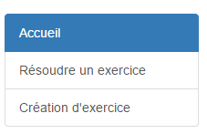

####################################
Comment, où créer un exercice
####################################

--------------------------------------
La page de création d'exercice
--------------------------------------

L'application exercice possède un onglet `création d'exercice <https://webmath-thirteenfoil8.c9.io/exercises/create/>`_ , présent sur le menu latéral permettant de renvoyer à la page de
création d'exercice.

Cliquez sur l'onglet Création d'exercice pour aller sur la page de création. Une fois sur la page, un encadré ressemblant à ça devrait apparaître:

.. image:: figures/create.png

Tout est dit, il suffit juste de spécifier le titre, la donnée ainsi que l'équation à résoudre pour pouvoir créer un exercice. Si vous observez bien, vous remarquez un bouton aperçu présent
à côté de celui nommé valider. Celui-ci , sert une fois avoir insérer les données voulu d'avoir un aperçu de ce qui sera présent dans l'exercice.

--------------------------------------
Le code en lui-même
--------------------------------------

.........................................
Le template
.........................................

Dans le template create.html, rien de spécial y apparait mise à part les 2 <input> et le <textarea> qui seront utilisés dans la vue "create" plus tard.

.. code-block:: html

    <input type="text" id="title" name="title" class="form-control">
    <textarea id="donnee" class="form-control" name="donnee"></textarea>
    <input type="text" id="equation" name="equation" class="form-control">

........................................
La vue
........................................

Pour ce qui est du code fonctionnant derrière cette partie de mon application, la difficulté se trouve surtout dans la sauvegarde des données.

En effet, il a fallu pour chaques balises <textarea> ou <input> permettant d'entrer les valeurs du titre, de la donnée et de l'équation puissent être enregistrer dans une variable et les enregistrer
dans la base de donnée dans la table "Exercices". Le code qui m'a permis de faire cela se trouve dans le fichier views.py dans la vue "create".

.. code-block:: python
    
    def create(request):
    if request.method == 'POST': # sauvegarde des données dans la db
        title = request.POST['title']
        donnee = request.POST['donnee']
        equation = request.POST['equation']
        
        Exercise(title=title, donnee=donnee, equation=equation).save()
        
        return HttpResponseRedirect(reverse("exercises:index"))
    else:
        return render(request, 'exercises/create.html')
        
La partie se trouvant dans le "if" permet de mettre dans des variales les valeurs récupérées. Il est a noté qu'il y a une partie else présente dans cette vue.
Cela indique seulement que si il n'y a pas de données à enregistrer, le template se charge normalement. Dès le moment où des données sont enregistrées, l'utilisateur est renvoyé à la page d'accueil.
Ceci permet juste que l'utilisateur ne crée pas de doublons en cliquant plusieurs fois sur "Valider" et qu'il comprenne que son exercice a bien été enregistré.