##################################
Documentation de l'utilisateur
##################################

En premier lieu, une explication de comment fonctionne le site du côté des utilisateurs est nécessaire.

--------------------------------------
Les fonctionnalités
--------------------------------------

Il est a noté que ce site internet possède un système d'authentification. Il est donc indispensable de se connecter avant de pouvoir utiliser les fonctionnalités du site.
Pour ce connecter, il suffit de cliquer sur *Rechercher un exercice* ou *Création d'exercice* pour être rediriger vers la page d'inscription ou de connection.
Il existe deux types de compte pour cette application, un compte professeur ou un compte élève. Cela veut dire que les fonctionnalités qu'un compte professeur possède 
ne sont pas les mêmes qu'un compte élève. En effet, un professeur peut accéder à toutes les pages du site, cependant, les droits de élève sont moindres.

...................................
Les fonctionnalités du professeur
...................................

Les fonctionnalités qu'un professeur possède sont les suivantes:

1. Créer un exercice.
    L'apport principal d'un professeur dans cette application est la création des exercices. En effet, un professeur peut créer des exercices soit en cliquant sur l'onglet *Création d'exercice*, 
    soit en  entrant l'url http://webmath-thirteenfoil8.c9.io/exercises/create/ dans la barre de recherche du navigateur utilisé.
    En parallèle à l'exercice créé, il doit créer son corrigé.

2. Contrôler la résolution des élèves:
    Pour que l'exercice puisse avoir un suivi de son créateur, un page s'occupant d'afficher toutes les résolutions faites par les élèves est disponible. Sur cette page , 
    le professeur voit l'équation de l'exercice qu'il a fait mais également les résolutions accompagnées du nom de l'élève et de la date de résolution.
    

......................................
Les fonctionnalités de l'élève
......................................

Les fonctionnalités qu'un élève peut utiliser sont les suivantes:

1. Résoudre un exercice:
    Grâce au système de recherche présent sur la page http://webmath-thirteenfoil8.c9.io/exercises/find/ , il est simple pour un élève de trouver un exercice à résoudre.
    
    
2. Voir le corrigé d'un exercice:
    Suite à la résolution d'un exercice, l'élève est redirigé sur le corrigé de celui-ci. Tout le développement de la résolution y figure. Cela permet à l'élève de bien comprendre 
    ses fautes en prévisions d'une amélioration de ses capacités mathématiques.
    
--------------------------------------
La navigation sur le site
--------------------------------------

................
Les urls
................

La manière la plus simple de se rendre directement sur une page est de rentrer l'url exact dans le navigateur.

Les urls de cette application fonctionne comme ci-dessous :

* Page d'accueil: http://webmath-thirteenfoil8.c9.io/exercises/
* Page de création d'un exercice: http://webmath-thirteenfoil8.c9.io/exercises/create/
* Page de recherche des exercices: http://webmath-thirteenfoil8.c9.io/exercises/find/
* Page de résolution d'un exercice: http://webmath-thirteenfoil8.c9.io/exercises/resolve/<numéro de l'exercice>/
* Page du corrigé d'un exercice: http://webmath-thirteenfoil8.c9.io/exercises/correction/<numéro de l'exercice>/
* Page des résolutions d'un exercice: http://webmath-thirteenfoil8.c9.io/exercises/done/<numéro de l'exercice>/

..................................
Le schéma de navigation des pages
..................................

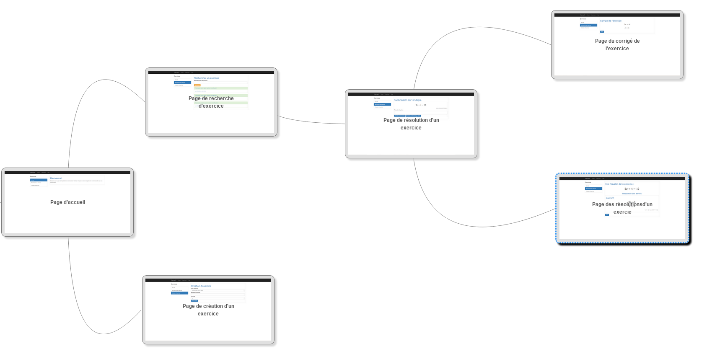
    
    *Schéma de navigation*
    
.. raw:: latex

    \pagebreak

------------------------------------
Fonctionnement des différentes pages
------------------------------------

....................
La page d'accueil
....................

La page d'accueil sert simplement à l'utilisateur d'accéder au site sans avoir à se connecter.

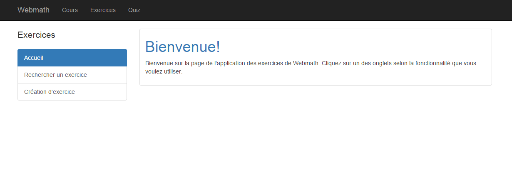
    
    *La page d'accueil*

Sur cette page, il y a différents onglets cliquables:

* *Webmath*
    Cet onglet renvoie sur la page d'accueil.

* *Cours*
    Celui-ci ne renvoie vers aucune page pour le moment (en développement).

* *Exercices*
    Celui-ci renvoie vers la page d'accueil de l'application exercice.

* *Quiz*
    Cet onglet redirige l'utilisateur vers la page d'accueil de l'application Quiz.

* *Accueil*
    Celui-ci renvoie vers la page d'accueil de l'application exercice.

* *Rechercher un exercice*
    Cet onglet redirige l'utilisateur vers la page de recherche d'exercice. 

* *Création d'exercice*
    Et finalement, l'onglet *Création d'exercice* renvoie vers la page de création d'exercice.

...............................
La page de création d'exercices
...............................

La page de création d'exercice n'est accessible que par les professeurs.
Elle se présente de la manière suivante:

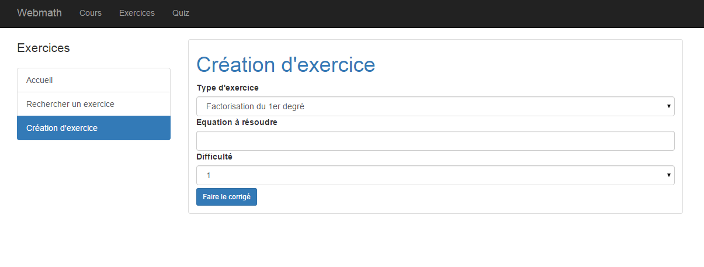
    
    *La page de création*

On remarque que sur cette page, on demande à l'utilisateur d'entrer des données:

* *Type d'exercice*
    On fait le choix entre les quatres possibilités de la liste déroulante.

* *Equation à résoudre*
    L'utilisateur entre l'équation qui sera résolu par un élève.

* *Difficulté*
    Denouveau, on choisit entre les possibilités de la liste déroulante. Cela donne une indication de la difficulté de l'exercice à l'élève. Cette difficulté est croissante de 1 jusqu'à 5.

De plus, le bouton *Faire le corrigé* permet d'afficher la suite du formulaire que l'utilisateur doit remplir.

Voici un exemple de comment remplir un formulaire. Pour ce qui est du corrigé, il faut entrer chaque étape de l'équation ligne par ligne.
Une fois le corrigé fini, le bouton *Soumettre l'exercice* enregistre les données du formulaire et redirige le professeur vers la page d'accueil.

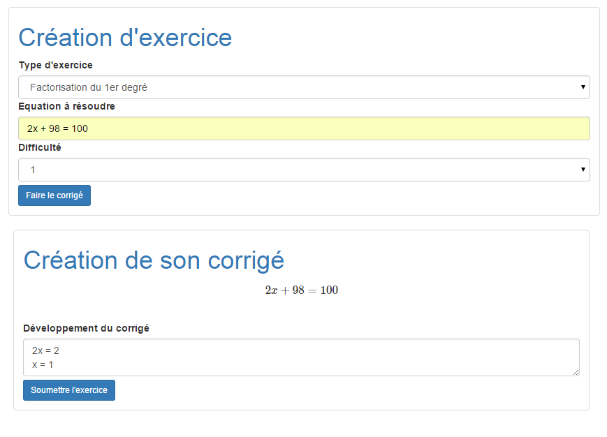
    
    *Remplir le formulaire de création*

Si il manque une donnée, le message suivant s'affiche.

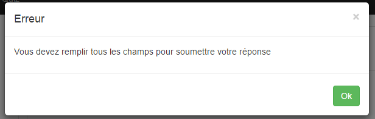
    
    *Message d'erreur*
    

.. raw:: latex

    \pagebreak

..................................
La page de recherche
..................................

Sur la page de recherche, le bouton *Rechercher* permet de trouver l'exercice correspondant au numéro entré dans la barre de recherche juste au-dessus.
Cependant, on peut également faire une recherche manuelle en faisant défiler la page.
Chaque fois qu'un professeur crée un nouvel exercice, il s'ajoute à la liste.
Le lien le plus foncé permet de se rendre à la page de résolution de l'exercice.
Le lien le plus clair, quant à lui, redirige l'utilisateur, qui doit être un professeur, vers la page contenant l'ensemble des résolutions pour un exercice.

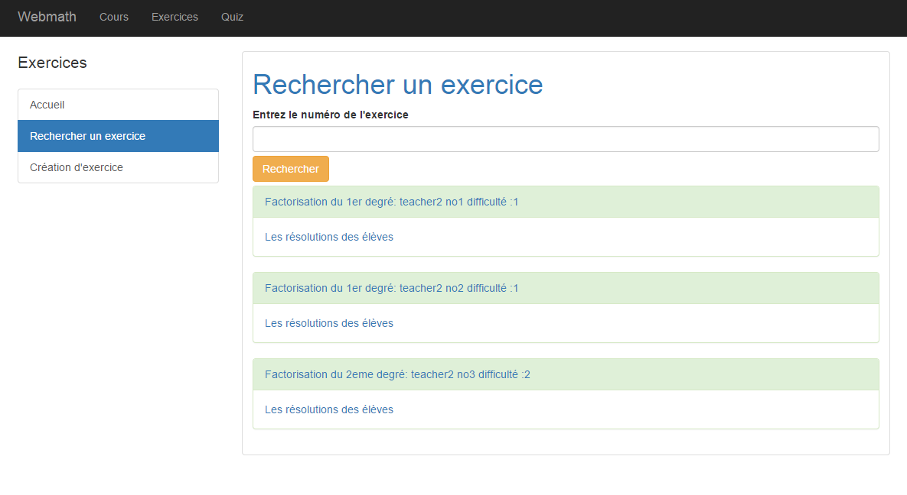
    
    *La page de recherche*

Pour ce qui est de la recherche, si l'exercice existe, un message s'affiche avec le lien de l'exercice.

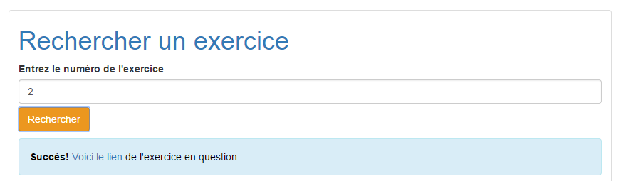
    
    *Message positif de recherche*

Dans le cas où l'exercice n'existe pas, un message d'erreur apparaît.

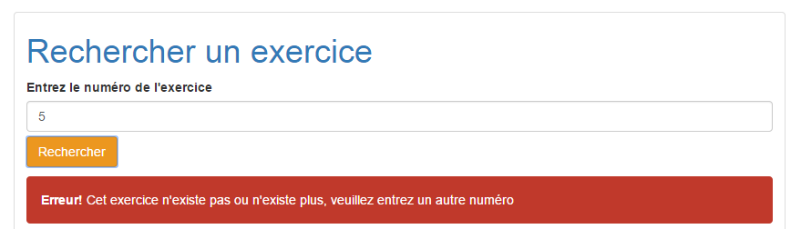
    
    *Message négatif de recherche*

.. raw:: latex

    \pagebreak

..................................
La page de résolution d'exercices
..................................

La page de résolution d'exercice est assez similaire à la page de création. En effet, il y a également la présence d'un formulaire que l'élève doit remplir.
Le seul champ à remplir est la résolution de l'exercice en prenant en compte d'écrire les étapes ligne par ligne.
Sur cette page, trois boutons sont disponibles:

* *Soumettre et voir le corrigé*
    Ce bouton enregistre la résolution et renvoie l'élève vers le corrigé.

* *Résolutions de cet exercice*
    Celui-ci renvoie l'utilisateur qui doit être un professeur vers la page contenant les résolutions des élèves.

* *Retour*
    Et finalement, le bouton *Retour* redirige l'utilisateur à la page de recherche.

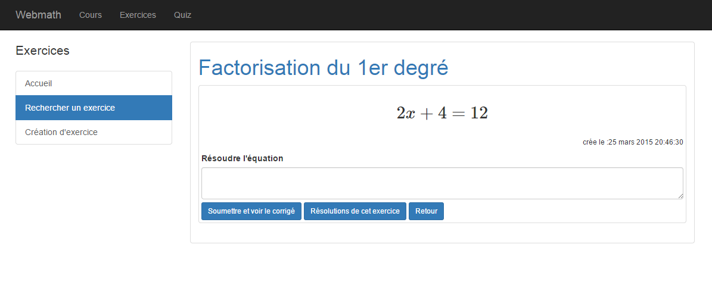
    
    *La page de résolution*

Voici un exemple de résolution:

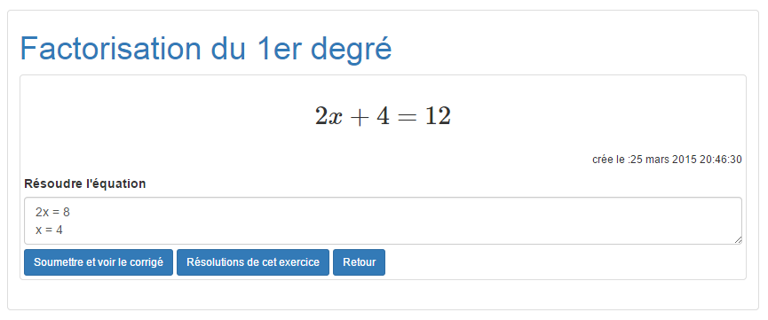
    
    *Exemple de résolution*

Si il manque une donnée, le message suivant s'affiche.

    
    *Message d'erreur*

.. raw:: latex

    \pagebreak

   
.........................
La page des résolutions
.........................

Cette page n'est accessible que par les professeurs.
Elle sert uniquement à afficher les résolutions faites par les élèves. Les résolutions contiennent le nom de l'élève, sa résolution et la date de résolution.
Un bouton *Retour* permet de retourner à la page de recherche.

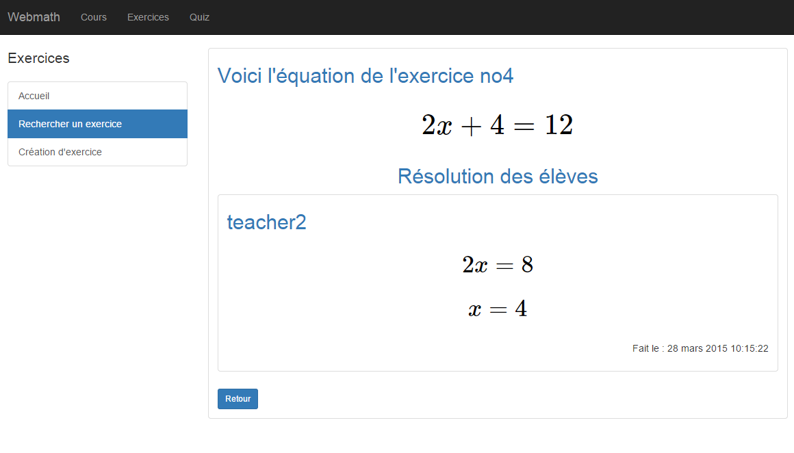
    
    *La page des résolutions d'un exercice*

De plus, si un exercice possède encore aucune résolution, le message suivant s'affiche.

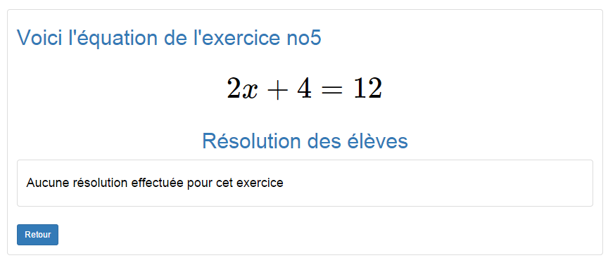
    
    *Aucune résolution*

.. raw:: latex

    \pagebreak

............................
La page du corrigé
............................

Ceci est la dernière page du site. Elle permet à un élève de voir le corrigé de l'exercice qu'il vient de résoudre.
Le bouton *Retour* redirige l'utilisateur vers la page de recherche.

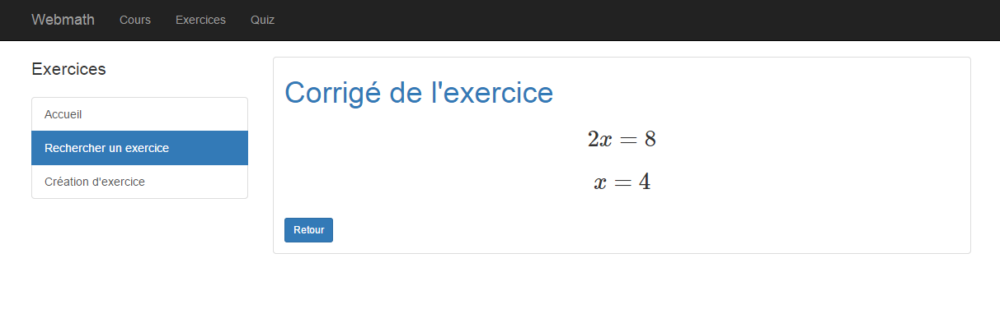
    
    *La page du corrigé*
