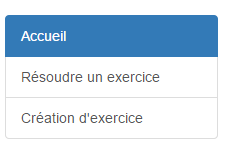

####################
L'application exercice, c'est quoi ?
####################

Voici la documentation de l'application Exercices présente sur le site `suivant <https://webmath-thirteenfoil8.c9.io/exercises/>`_ . Celle-ci vous premettra de
pouvoir utiliser la partie création ainsi que la partie résolution des exercices de manière complète et détaillée. Cette application servira par la suite à un 
professeur de pouvoir créer un exercice ( principalement de factorisation ou bien de calcul) et de pouvoir le mettre en ligne. Il suffira de donner le lien de
l'exercice à l'élève pour qu'il puisse le résoudre. 

Cette application consiste en premier lieu d'avoir un support internet sur lequel un élève du Csud pourrait s'entraîner en prévision de ses examens ou alors tout simplement
pour perfectionner ses capacités en mathématique dans le domaine de la factorisation et dans celui du calcul. Elle est essentielle au projet pour que les professeurs puissent
créer des exercices selon le besoin de leur élève et pour pouvoir analyser les erreurs que les élèves font par rapport à ceux-ci. Cela permet aussi à un élève de savoir où sont
ses difficultés et de savoir quelles sont les thèmes qu'il doit travailler. Django permet de pouvoir stocker les données créées par les
professeurs dans une base de données et de pouvoir récupérer celle-ci pour en faire des pages. Cela est exactemenet ce dont nous avons besoin pour cette application car le 
professeur en question crée un exercice et la partie backend très développée de Django s'occupe de créer la page web contenant les données entrées précédemment.

####################################
Comment, où créer un exercice
####################################

L'application exercice possède un onglet `création d'exercice <https://webmath-thirteenfoil8.c9.io/exercises/create/>`_ , présent sur le menu latéral permettant de renvoyer à la page de
création d'exercice.

Cliquez sur l'onglet Création d'exercice pour aller sur la page de création. Une fois sur la page, un encadré ressemblant à ça devrait apparaître:

Tout est dit, il suffit juste de spécifier le titre, la donnée ainsi que l'équation à résoudre pour pouvoir créer un exercice. Si vous observez bien, vous remarquez un bouton aperçu présent
à côté de celui nommé valider. Celui-ci , sert une fois avoir insérer les données voulu d'avoir un aperçu de ce qui sera présent dans l'exercice.
